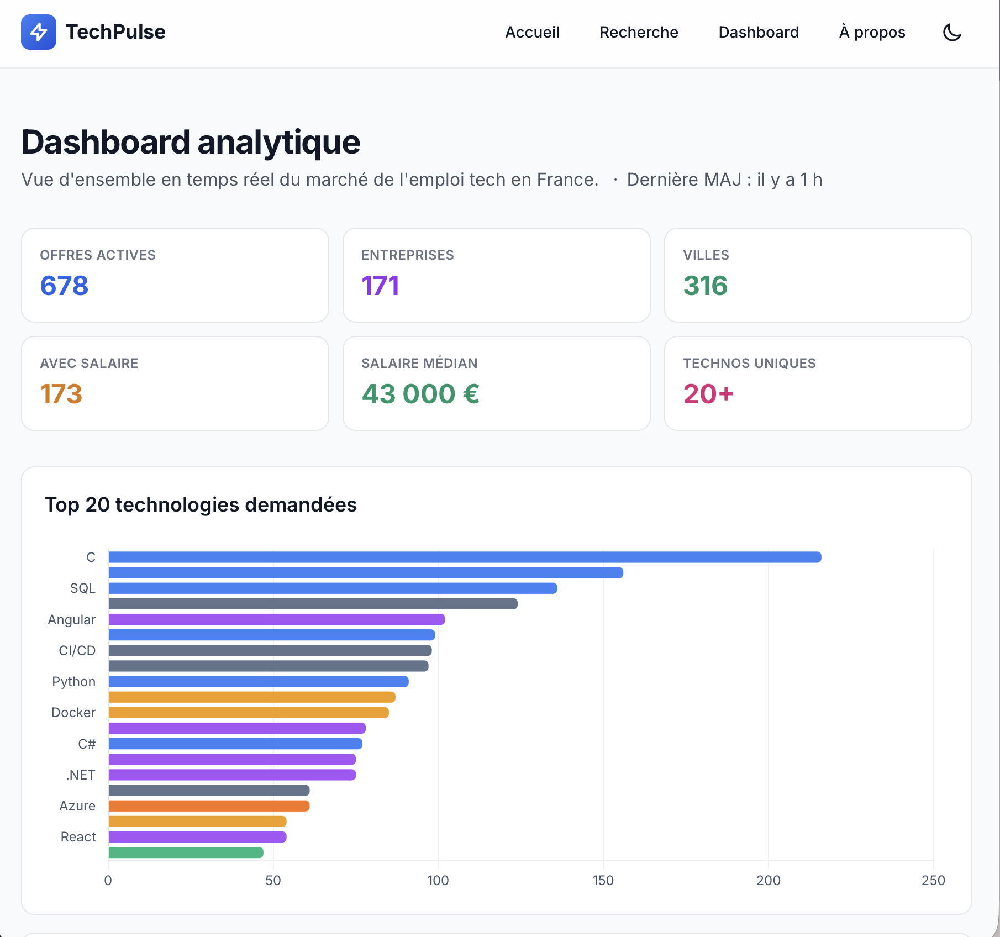

# TechPulse

[](https://github.com/Bastagas/techpulse/actions/workflows/ci.yml)
[](https://www.python.org/)
[](https://www.php.net/)
[](https://www.mysql.com/)
[](https://docs.docker.com/compose/)
[](LICENSE)

> **Observatoire du marché de l'emploi tech en France.** Scrape en continu France Travail (API officielle) pour cartographier les technologies demandées, les salaires, les localisations et les tendances du moment. Prédit votre salaire via RandomForest. Design Liquid Glass avec command palette ⌘K, cursor-glow, count-up, heatmap calendaire, progress ring percentile.



<p align="center">
  <strong><a href="https://github.com/Bastagas/techpulse">⭐ Étoile le repo sur GitHub</a></strong>
</p>

---

## 🎯 Pourquoi TechPulse ?

Dans un marché tech en évolution rapide, **quelles technologies recrutent *vraiment* en France aujourd'hui ?** TechPulse répond à cette question en agrégeant 5 000+ offres d'emploi en continu, puis :

- **Extrait les technologies** de chaque offre via NLP hybride (regex + spaCy français sur 202 technos canoniques)
- **Géolocalise** chaque offre sur la carte de France (API Adresse Data Gouv)
- **Visualise** les tendances dans un dashboard analytique (Chart.js + Leaflet)
- **Expose une API REST** documentée automatiquement via Swagger UI

Sujet du projet de professionnalisation M2 — Web Scraping, Université de Montpellier, 2025-2026.

---

## 🏗️ Architecture

```
                  ┌──────────────┐        ┌──────────────┐
                  │  PHP + Twig  │        │ Flask+Smorest│
                  │  Tailwind    │        │  (OpenAPI)   │
                  │  Alpine.js   │◄──────►│  APScheduler │
                  └──────┬───────┘        └──────┬───────┘
                         │                       │
                         └───────────┬───────────┘
                                     ▼
                          ┌───────────────────┐
                          │    MySQL 8 + FT   │◄── phpMyAdmin
                          └─────────┬─────────┘
                                    ▲
              ┌─────────────────────┤
              │                     │
     ┌────────┴────────┐   ┌────────┴─────────┐
     │  Spider FT API  │   │  Spider HelloWork│
     │  (OAuth2)       │   │  (HTML async)    │
     └─────────────────┘   └──────────────────┘
             │                     │
             ▼                     ▼
     ┌──────────────────────────────┐
     │  Parsers NLP + Dedup + Geocode│
     │     SHA-256 fingerprints      │
     └──────────────────────────────┘
```

### Stack

| Couche | Technologies |
|---|---|
| **Scraping** | Python 3.11 · httpx async · tenacity (retry + backoff) · selectolax · spaCy français |
| **Persistence** | SQLAlchemy 2 · PyMySQL · Pydantic v2 |
| **BDD** | MySQL 8 + phpMyAdmin |
| **API** | Flask · flask-smorest (Swagger auto) · APScheduler · Marshmallow |
| **Frontend** | PHP 8 · PDO · Twig · Tailwind CSS · Alpine.js · Chart.js · Leaflet |
| **Infra** | Docker + docker-compose · GitHub Actions · Railway |

---

## 🚀 Setup en 1 commande (Docker)

Prérequis : [OrbStack](https://orbstack.dev) ou Docker Desktop, Python 3.11+, PHP 8+.

```bash
make setup      # démarre MySQL + phpMyAdmin, installe les deps Python et PHP
make scrape     # lance le scraping France Travail (~1 min pour 500 offres)
make geocode    # géocode les villes (~30 s)
make dev        # démarre l'API Flask et le frontend PHP
```

Puis ouvre dans ton navigateur :
- **Frontend** : http://localhost:8000
- **Dashboard** : http://localhost:8000/dashboard.php
- **API Swagger** : http://localhost:5001/docs
- **phpMyAdmin** : http://localhost:8080 (`root` / `rootpass`)

### Stack complète containerisée (API + frontend + MySQL + phpMyAdmin)

```bash
docker compose --profile full up -d --build
```

---

## 🏫 Setup alternatif — MAMP (sans Docker, pour grading)

Voir **[GUIDE_PROF.md](GUIDE_PROF.md)** pour les instructions pas-à-pas détaillées.

```bash
bash setup_mamp.sh    # venv + deps + config MAMP
# Puis :
# 1. Lancer MAMP, importer db/techpulse_snapshot.sql (~3000 offres)
# 2. source .venv/bin/activate && python -m techpulse_api &
# 3. php -S localhost:8000 -t frontend/public
```

---

## 📖 Commandes Makefile

```bash
make help              # liste toutes les commandes
make setup             # setup complet Docker
make up / down         # stack up / down
make scrape            # scraper France Travail (8 codes ROME)
make scheduler-enable  # active APScheduler (cron quotidien 03:00 UTC)
make retrain           # réentraîne salary RF + similarity TF-IDF
make frontend-build    # build Tailwind CSS local minifié (30 KB)
make frontend-watch    # rebuild Tailwind en watch
make dev               # front + API en parallèle
make test              # pytest scraper + api
make lint              # ruff check
make backup            # dump BDD → db/backup/
make snapshot          # snapshot pour livrable prof → db/techpulse_snapshot.sql
```

```bash
# Tests frontend (PHPUnit + Playwright)
cd frontend
composer install && vendor/bin/phpunit               # 7 tests d'intégration DB
npm install && npx playwright install chromium
npx playwright test                                  # 5 tests E2E
```

## 🗂️ Structure

```
techpulse/
├── scraper/          # Python — pipeline scraping (httpx async, spaCy, SQLAlchemy)
│   ├── src/techpulse_scraper/
│   │   ├── spiders/        # France Travail API, HelloWork (à venir)
│   │   ├── parsers/        # location, salary, tech_extractor
│   │   ├── pipelines/      # dedup, persistence
│   │   └── utils/          # fingerprint, geocoder
│   └── tests/         # 32 tests pytest
├── api/              # Python — API Flask REST
│   ├── src/techpulse_api/
│   │   ├── routes/         # offers, stats, meta
│   │   ├── schemas.py      # Marshmallow
│   │   └── scheduler.py    # APScheduler
│   ├── tests/        # 14 tests pytest
│   └── Dockerfile
├── frontend/         # PHP — interface utilisateur
│   ├── src/          # bootstrap + Connection + Repos + views Twig
│   ├── public/       # index, search, offer, dashboard, export, api/autocomplete
│   └── Dockerfile
├── db/
│   ├── migrations/001_init.sql    # schéma (5 tables)
│   ├── seeds/02_technologies.sql  # 202 technos canoniques
│   └── techpulse_snapshot.sql     # dump prêt à importer (~1.9 MB)
├── docs/
│   ├── demo/               # captures, GIF
│   └── archi.png           # diagramme haut niveau
├── docker-compose.yml
├── Makefile
├── 01-cadrage.md           # Phase 1 : cadrage projet
├── 02-roadmap.md           # Phase 2 : roadmap d'exécution
├── GUIDE_PROF.md           # Guide correction sans Docker
└── DEPLOY.md               # Guide déploiement Railway
```

---

## 🧪 Tests & qualité

- **21 tests pytest scraper** : fingerprint, parsers (salary, location), dedup
- **14 tests pytest API** : /offers, /stats/*, /openapi, /health
- **7 tests PHPUnit** (intégration BDD réelle) : OfferRepository, filtres, pagination, timeline
- **5 tests Playwright E2E** (headless Chromium) : home, search, simulateur, dashboard, ⌘K palette
- **Ruff** : lint + format automatiques (CI bloquante)
- **GitHub Actions** : lint Python + tests + validation docker-compose

## 🔒 Sécurité & production

- **Rate limiting** Flask-Limiter : 120 req/min + 2000 req/h par IP
- **HTTP caching** : ETag/If-None-Match (304 conditional GET) + Cache-Control
- **Secrets** : `.env.local` gitignored, `.env.example` comme template vide
- **PDO paramétré à 100%** côté PHP, **SQLAlchemy ORM** côté Python — pas de concat SQL
- **Twig autoescape='html'** par défaut → pas de XSS sur rendu de description
- **Tailwind build local** (30 KB minifié) — plus de CDN runtime en prod

## 📊 Chiffres clés

- **6 098 offres actives** en BDD (France Travail, 8 codes ROME tech)
- **1 012 entreprises**, **200+ technologies distinctes** détectées
- **1 554 villes** couvertes
- **1 214 offres avec salaire** parsé (médiane = 40 k €)
- **RandomForest** entraîné sur 1214 offres, 838 features → fourchette P25-P75 + confidence
- **TF-IDF similarité** sur 6098 offres × 5000 features → recommandations `/offers/<id>/similar`
- **Scheduler APScheduler** activé (scrape quotidien 03:00 UTC)

## ⚖️ Éthique du scraping

- Respect systématique du `robots.txt` (`urllib.robotparser`)
- Rate limiting (1 req/2s par domaine, configurable)
- Usage privilégié de l'**API officielle France Travail** quand disponible
- Données publiques uniquement, zéro contournement de CAPTCHA
- User-agents réalistes

## 📚 Documentation

- **[01-cadrage.md](01-cadrage.md)** — cadrage du projet (Phase 1)
- **[02-roadmap.md](02-roadmap.md)** — roadmap d'exécution (Phase 2)
- **[GUIDE_PROF.md](GUIDE_PROF.md)** — guide correction sans Docker
- **[DEPLOY.md](DEPLOY.md)** — guide déploiement Railway (rapide, payant 5 $/mo)
- **[deploy/oracle/ORACLE.md](deploy/oracle/ORACLE.md)** — guide déploiement Oracle Cloud (gratuit à vie, ARM 24 GB)
- **API Swagger** : http://localhost:5001/docs quand l'API tourne

## 👤 Auteur

**Bastien Ruedas** · [@Bastagas](https://github.com/Bastagas) · M2, Université de Montpellier · 2025-2026

## 📄 Licence

MIT — voir [LICENSE](LICENSE)
