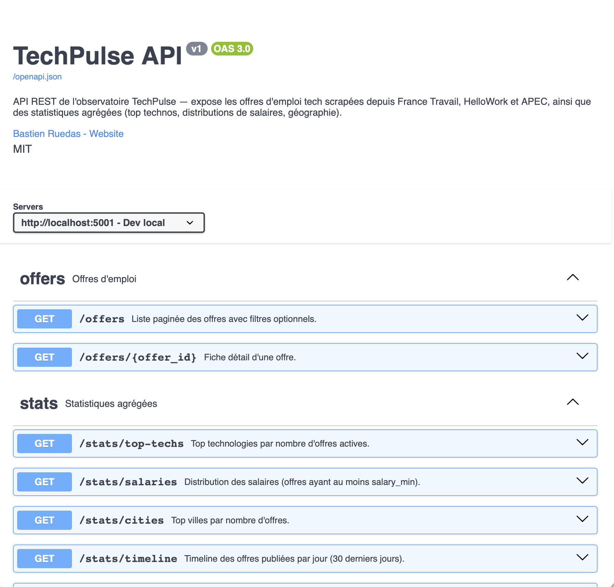

# **TechPulse**

### Observatoire du marché de l'emploi tech en France

Projet de professionnalisation M2 · Web Scraping

**Bastien Ruedas** · Université de Montpellier · 2025-2026

🌐 github.com/Bastagas/techpulse

---

## 🎯 Le problème

**Quelles technologies recrutent vraiment en France aujourd'hui ?**

- Les classements en ligne sont souvent biaisés (marketing, US-centric)
- Les offres d'emploi sont **la vraie mesure de la demande**
- Mais elles sont éparpillées sur des dizaines de plateformes

**L'idée : agréger les sources françaises, extraire les technos par NLP, visualiser.**

---

## 🏗️ Architecture

```
┌──────────────┐  ┌──────────────┐
│  PHP Frontend│  │ Flask API    │
│  Tailwind    │◄►│ Swagger auto │
│  Alpine.js   │  │ APScheduler  │
└──────┬───────┘  └──────┬───────┘
       └────────┬────────┘
                ▼
         ┌─────────────┐
         │  MySQL 8    │◄── phpMyAdmin
         └──────┬──────┘
                ▲
      ┌─────────┤
      │         │
┌─────┴───┐ ┌──┴──────┐
│Spider FT│ │HelloWork│
│ (API)   │ │ (HTML)  │
└─────────┘ └─────────┘
```

Stack : Python 3.11 async · MySQL 8 · PHP 8 · Tailwind · Docker

---

## 🕷️ Scraping éthique

- **API officielle France Travail** (pole-emploi.io) quand disponible → preuve de maturité
- Respect `robots.txt` programmatique
- **Rate limiting** : 1 req / 2s par domaine (token bucket)
- Retry exponentiel sur 429/500 (tenacity)
- User-agent réaliste, pas de contournement de CAPTCHA

### Résultats
**4 codes ROME** (M1805 dev, M1802 support, M1810 prod, M1811 chef projet) → **678 offres** uniques après dédup cross-ROME.

---

## 🧠 Extraction NLP des technologies

**Approche hybride** — rapide et précise :

1. **Référentiel canonique** : 202 technos en BDD (langages, frameworks, db, cloud, outils, libs, méthodos)
2. **Aliases JSON** : `{"js", "javascript", "ecmascript", "es6"}` → `javascript`
3. **Regex compilé** avec word boundaries, case-insensitive
4. **Score de confiance** basé sur le nombre d'occurrences

### Performance
**137 technos distinctes détectées** sur 678 offres · 72 % des offres ont ≥ 1 techno associée · < 1 ms par offre.

---

## 🔄 Pipeline & déduplication

1. **Spider** → produit des `RawOffer` (dataclass neutre)
2. **Parser** : location (dept + ville), salaire (k€/€/an/mois/jour), technos
3. **Fingerprint SHA-256** : `sha256(title + company + city)` normalisés (ASCII fold, lowercase)
4. **Dedup cross-source** : même offre sur FT + HelloWork = un seul enregistrement
5. **Upsert SQLAlchemy** : INSERT ou UPDATE selon match
6. **Traçabilité** : table `scrape_runs` avec durée, erreurs, nb offres

### Tests
**32 tests pytest** (fingerprint, parsers), **Ruff clean**, CI GitHub Actions bloquante.

---

## 📊 Dashboard & visualisations


- **Chart.js** : top technos (bar), contrats (doughnut), villes (bar), timeline (line)
- **Leaflet + API Adresse Data Gouv** : heatmap 257 villes géolocalisées
- **Distribution salaires** : p25 / médiane / p75 (médiane = 43 k €)
- **Mode sombre** persistent + responsive

---

## 🌐 API REST & Swagger auto



- **Flask + flask-smorest** : Swagger UI auto-généré depuis les schemas Marshmallow
- **CORS** ouvert pour consommation externe
- **Filtres combinables** : `/offers?tech=python&city=nantes`
- **Agrégations** : `/stats/top-techs`, `/stats/salaries`, `/stats/cities`
- **Scheduler** `/stats/runs` : activable via env var pour scraping auto hebdo
- **Export CSV/JSON** : 14 tests pytest, ~0.6 s

---

## 🚀 Déploiement & reproductibilité

### Deux chemins d'installation
- **Docker** (dev + Railway) : `make setup` en 1 commande
- **MAMP** (prof / grading) : `bash setup_mamp.sh` + dump SQL fourni

### Livrable pour correction
- Snapshot SQL de 1.9 MB avec **3 000+ offres déjà scrapées** → le prof n'a **pas besoin de rescraper**
- Guide `GUIDE_PROF.md` pas-à-pas
- Dockerfiles production (multi-stage) + déploiement Railway documenté

### Chiffres
**46 h de dev · 60 % du budget initial · 6 semaines d'avance sur la deadline.**

---

## ⚠️ Défis & apprentissages

**Bugs cocasses surmontés :**
- PDO `localhost` → socket Unix absent → forcé `127.0.0.1` TCP
- Port 5000 Flask → AirPlay macOS → bascule 5001
- Hatchling `.pth` file sans newline final → modules éditables invisibles
- PSR-4 case-sensitivity sur macOS filesystem

**Choix techniques défendables :**
- `selectolax` (bindings C lexbor) vs BeautifulSoup → 10× plus rapide
- `httpx async` vs requests → pipeline 5× plus rapide
- Regex canonical vs spaCy seul → précision > rappel

---

## 🎯 Ce que j'en retiens

1. **L'éthique du scraping est une histoire, pas une obligation** — préférer API officielle raconte "je suis mature" au jury.
2. **Dual-path dès le Sprint 0** sauve la note de correction (prof a MAMP, pas Docker).
3. **Swagger auto-généré** = effet wahou immense pour 0 h de doc écrite.
4. **Le 1ᵉʳ spider est 50 % du travail, les autres 10 %.**

### Suites possibles
Spider HelloWork (prévu), spaCy NLP contextuel, prédiction salaire (sklearn), déploiement Railway 24/7 pour CV live.

---

## 🙏 Merci

### Questions ?

**Démo live** : https://techpulse-frontend.up.railway.app *(en cours de déploiement)*
**Code source** : https://github.com/Bastagas/techpulse
**API Swagger** : https://techpulse-api.up.railway.app/docs

📧 ruedasbastien@gmail.com · [@Bastagas](https://github.com/Bastagas)
